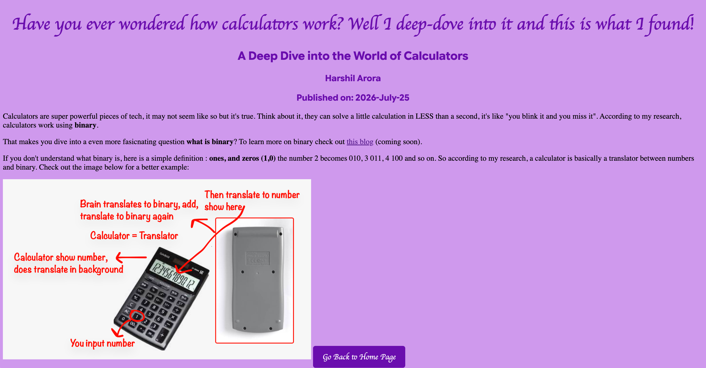

# my-cool-site
Welcome to **my cool site / blog** for Stardance

## What the site looks like



## Avalaible files
The avalaible files/folders are:
```
assets/
index.html
blog1.html
404.html (just enter anything after / to see what it looks like)
style.css
README.md(this)
LICENSE
```

## What can you use for yourself?
Basically everything in this repo, wait actually, **everything** in this repo (it's open-source), that's why you can see this and the code.

## Forking
How someone might fork this project you might ask? Just do this:
```
git clone https://github.com/harshilarora250/my-cool-site/
cd my-cool-site
nano index.html #(you can now change the code easily)
```
To launch the website for yourself after making your personal changes, first push the updated folder to a github repo of your own. Use the free plan on vercel to host the website for free

## What it does
It rickrolls you, and it's my blog. My Cool Blog (that sounds good -eh?)
It's a **blog**

## AI Usage
I used AI in this project for learning new variables within css and html. Technically I didn't use it but I did thanks to google ai overview.

## Contribution
If you would like to contact the developer of the project/blog, you can click on his name to go on the contact section of his personal portfolio. [Harshil Arora](https://elipseday-nine.vercel.app/#contact).